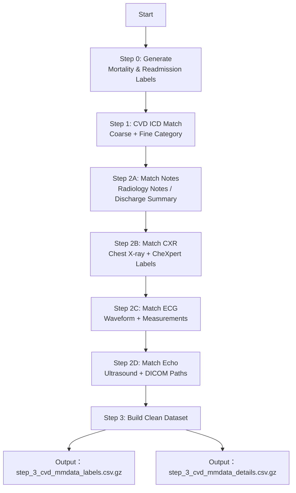

# 🩺 1. Project Goal

This pipeline integrates cardiovascular disease (CVD)–related data from MIMIC-IV (v3.1) and matches **multimodal information collected during hospitalization**, including:

- **Notes** (clinical text such as discharge summaries and radiology reports)
- **CXR** (chest X-ray images)
- **ECG** (electrocardiogram waveforms and automated measurements)
- **Echo** (echocardiography DICOM studies)

The final outcome is a **multimodal CVD inpatient cohort**, directly usable for model training, risk prediction, and clinical research.

---

# 📁 2. Directory Structure

The following shows the main directory structure used by the pipeline (abstracted as the `PATHS` dictionary in the code):

```
CVD_MMData/
│
├── mimiciv/3.1/hosp/         # 住院表、ICD、患者基本信息
├── mimiciv/3.1/icu/          # ICU stays
├── mimiciv/note/             # 临床文本（radiology, discharge 等）
├── mimiciv/cxr/              # CXR 影像和 CheXpert 标签
├── mimiciv/ecg/              # ECG 测量与波形路径
├── mimiciv/echo/             # Echo（超声心动图）路径与 study meta
│
├── step0_death_admissionlabel/      # Step 0 输出
├── step1_cvd_filter/                 # Step 1 输出
└── step2_multimodal_matching/        # Step 2 与 Step 3 输出
```

---

# 🧩 3. Processing Pipeline

The workflow consists of **Step 0 → Step 1 → Step 2A/B/C/D → Step 3**.

---

# 📝 Step 0 — Mortality and Readmission Label Generation

**Purpose:** Generate prediction labels for each hospital admission (`hadm_id`).

### ✔ Input Files

- `admissions.csv.gz` (admission/discharge times)
- `patients.csv.gz` (date of death)
- `diagnoses_icd.csv.gz` (diagnoses)

### ✔ Output Fields

| Field                 | Meaning                             |
| --------------------- | ----------------------------------- |
| mortality_in_hospital | Death occurred during admission     |
| mortality_30d         | Death within 30 days post-discharge |
| readmission_30d_hosp  | Hospital readmission within 30 days |
| readmission_30d_icu   | ICU readmission within 30 days      |
| days_disch_to_death   | Days from discharge to death        |

**Output file:** `mimiciv_3_1_labels_details_[mode].csv.gz`

---

# 💓 Step 1 — CVD Label Matching and Cohort Selection

**Purpose:** Identify CVD-related admissions using ICD-9 and ICD-10 codes.

This step uses two category mapping files:

- `CVD_coarse_category.csv` — coarse groups  
  (e.g., **CHD** = Coronary Heart Disease, **HF** = Heart Failure, **VHD** = Valvular Heart Disease)
- `CVD_fine_category.csv` — detailed subtypes  
  (e.g., STEMI, NSTEMI, Ischemic Stroke)

### ✔ Output Fields

| Field               | Meaning                                  |
| ------------------- | ---------------------------------------- |
| CVD_coarse_category | Coarse category (CHD/HF/VHD/etc.)        |
| CVD_fine_category   | Fine-grained subtype (STEMI/Stroke/etc.) |

**Output file:** `step_1_details_cvd_only_[mode].csv.gz`

Only CVD-matched admissions are retained.

---

# 🩻 Step 2 — Multimodal Data Matching

Matches the Step 1 CVD cohort with four modalities using the **hospitalization time window**.

Matching rule:

> **Timestamp ∈ \[admittime, dischtime\]**

---

## 2A — Note Matching

Matches radiology notes and discharge summaries.

Example fields:

- has_note
- note_count
- matched_note_ids
- matched_note_times

---

## 2B — CXR Matching

Matches metadata, CheXpert labels, and DICOM image paths.

Example fields:

- has_cxr
- cxr_study_count
- matched_cxr_image_paths
- matched_cxr_CheXpert

---

## 2C — ECG Matching

Includes automated measurements and linked notes.

Example fields:

- has_ecg
- ecg_count
- matched_ecg_waveform_paths

---

## 2D — Echo Matching

Matches Echo metadata and DICOM paths.

Example fields:

- has_echo
- echo_study_count
- matched_echo_dicom_paths

**Final output:**  
`step_2d_details_cvd_with_note_with_cxr_with_ecg_with_echo_[mode].csv.gz`

---

# 🧼 Step 3 — CLEAN Version (Final Dataset)

**Purpose:** Keep only admissions with **at least one** modality.

Filter condition:

```
has_note == 1 OR has_cxr == 1 OR has_ecg == 1 OR has_echo == 1
```

### ✔ Clean Labels (for training)

Fields include:

- subject_id, hadm_id
- ICD coarse/fine labels
- outcome labels (mortality/readmission)
- modality existence flags

File: `step_3_cvd_mmdata_labels_[mode].csv.gz`

---

### ✔ Clean Details (for loading modality content)

Contains all aggregated paths, timestamps, and list fields.

File: `step_3_cvd_mmdata_details_[mode].csv.gz`

---

# 🩻 Step 2 & Step 3 — Detailed Outputs

## A. Step 2 — Multimodal Matching Outputs

Saved under `step2_multimodal_matching/`.

### 📄 Intermediate Aggregated Files

| File name                                                     | Description    | Key fields                                                       |
| ------------------------------------------------------------- | -------------- | ---------------------------------------------------------------- |
| step*2a_details_cvd_with_note*[mode].csv.gz                   | Notes matching | has_note, note_count, matched_note_ids                           |
| step*2b_details_cvd_with_note_with_cxr*[mode].csv.gz          | CXR matching   | has_cxr, cxr_study_count, matched_cxr_dicom_ids, CheXpert labels |
| step*2c_details_cvd_with_note_with_cxr_with_ecg*[mode].csv.gz | ECG matching   | has_ecg, ecg_count, waveform paths, ECG measurements             |
| step*2d_details_cvd_with_all_mm*[mode].csv.gz                 | All modalities | includes Echo fields                                             |

---

### 🖼 Raw Modality Files

| File                                       | Description                     | Fields                                   |
| ------------------------------------------ | ------------------------------- | ---------------------------------------- |
| cvd*matched_notes_content*[mode].csv.gz    | Matched note text               | note_id, text                            |
| cvd*matched_cxr_reports*[mode].csv.gz      | Matched CXR report text         | report_text, report_path                 |
| cvd*matched_cxr_metadata*[mode].csv.gz     | CXR metadata + CheXpert         | dicom_id, image_path, 14 CheXpert labels |
| cvd*matched_ecg_measurements*[mode].csv.gz | ECG machine measurements        | rr_interval, p_axis, etc.                |
| cvd*matched_ecg_details*[mode].csv.gz      | ECG waveform paths + note links | waveform_path, measurement fields        |
| cvd*matched_echo_details*[mode].csv.gz     | Echo DICOM metadata             | echo_dicom_paths                         |

---

# ▶ Running the Code

Default (fast) DEBUG mode:

```
python extract_cvd_multimodal_pipeline.py --mode DEBUG
```

Full dataset (FULL mode):

```
python extract_cvd_multimodal_pipeline.py --mode FULL
```

---

# 📌 Cardiovascular Disease ICD Matching System (CVD Classification System)

The CVD matching in this project is based on a **two-tier classification system**:

- **Coarse Categories**: Grouped by organ system or major disease class.
- **Fine Categories\***: Correspond to common clinical subtypes (e.g., STEMI, NSTEMI, TIA, etc.).

---

## 🟥 Coarse Categories (English/Chinese) + ICD Ranges

The following corresponds to `CVD_coarse_category.csv` in the code:

| InternalCode | ICD9 Range | ICD10 Range   | English Name                                                | 中文名称             |
| ------------ | ---------- | ------------- | ----------------------------------------------------------- | -------------------- |
| **CVD_A**    | 390–398    | I00–I09       | Rheumatic heart diseases                                    | 风湿性心脏病         |
| **CVD_B**    | 401–405    | I10–I16       | Hypertensive diseases                                       | 高血压及相关心血管病 |
| **CVD_C**    | 410–414    | I20–I25       | Ischemic heart diseases                                     | 缺血性心脏病         |
| **CVD_D**    | 415–417    | I26–I28       | Pulmonary heart disease and pulmonary circulation disorders | 肺心病及肺循环疾病   |
| **CVD_E**    | 420–429    | I30–I52 / I5A | Other heart diseases                                        | 其他心脏疾病         |
| **CVD_F**    | 430–438    | I60–I69       | Cerebrovascular diseases                                    | 脑血管疾病           |
| **CVD_G**    | 440–448    | I70–I79       | Arterial / arteriolar / capillary diseases                  | 动脉与微血管疾病     |
| **CVD_H**    | 451–459    | I80–I89       | Venous and lymphatic diseases                               | 静脉、淋巴管疾病     |

> 📝 Coarse categories are often used for high-level disease studies, such as "Ischemic heart diseases (CVD_C)" or "Cerebrovascular diseases (CVD_F)"。

---

## 🟦 Fine Categories (English/Chinese) + ICD Ranges

The following corresponds to `CVD_fine_category.csv` in the code, containing more clinical disease entities:：

| InternalCode | ICD9 Code | ICD10 Code | English Name                                          | 中文名称                          |
| ------------ | --------- | ---------- | ----------------------------------------------------- | --------------------------------- |
| **CVD_A1**   | 394–397   | I05–I09    | Rheumatic valvular disease                            | 风湿性瓣膜病                      |
| **CVD_E1**   | 424       | I34–I37    | Nonrheumatic valvular disease                         | 非风湿性瓣膜病                    |
| **CVD_C1**   | 410       | I21–I22    | Acute myocardial infarction (AMI, incl. STEMI/NSTEMI) | 急性心肌梗死（含 STEMI / NSTEMI） |
| **CVD_C2**   | 414       | I24–I25    | Chronic ischemic heart disease                        | 慢性缺血性心脏病                  |
| **CVD_C3**   | 413       | I20        | Angina pectoris                                       | 心绞痛                            |
| **CVD_E2**   | 428       | I50        | Heart failure (HF)                                    | 心力衰竭                          |
| **CVD_E3**   | 425       | I42        | Cardiomyopathy                                        | 心肌病                            |
| **CVD_E4**   | 420       | I30–I32    | Pericarditis                                          | 心包炎                            |
| **CVD_E5**   | 422       | I40        | Myocarditis                                           | 心肌炎                            |
| **CVD_E6**   | 421 / 424 | I33–I38    | Endocarditis                                          | 心内膜炎                          |
| **CVD_E7**   | —         | I5A        | Non-ischemic myocardial injury                        | 非缺血性心肌损伤                  |
| **CVD_D1**   | 416       | I26–I28    | Pulmonary heart disease                               | 肺心病                            |
| **CVD_F1**   | 430       | I60        | Subarachnoid hemorrhage (SAH)                         | 蛛网膜下腔出血                    |
| **CVD_F2**   | 431       | I61        | Intracerebral hemorrhage (ICH)                        | 脑出血 / 颅内出血                 |
| **CVD_F3**   | 432       | I62        | Other intracranial hemorrhage                         | 其他颅内出血                      |
| **CVD_F4**   | 433–434   | I63        | Cerebral infarction (Ischemic Stroke)                 | 脑梗死 / 缺血性脑卒中             |
| **CVD_F5**   | 435       | G45        | TIA (Transient Ischemic Attack)                       | 短暂性脑缺血发作                  |
| **CVD_F6**   | 438       | I69        | Sequelae of cerebrovascular diseases                  | 脑血管病后遗症                    |
| **CVD_G1**   | 440       | I70        | Atherosclerosis                                       | 动脉粥样硬化                      |
| **CVD_G2**   | 441       | I71        | Aneurysm                                              | 动脉瘤                            |
| **CVD_G3**   | 443       | I73        | Occlusive peripheral arterial disease                 | 动脉闭塞性疾病                    |
| **CVD_H1**   | 451       | I80        | Phlebitis & thrombophlebitis                          | 静脉炎与血栓性静脉炎              |
| **CVD_H2**   | 457       | I88–I89    | Lymphatic diseases                                    | 淋巴系统疾病                      |
| **CVD_H3**   | 458–459   | I95–I99    | Other/unspecified circulatory disorders               | 其他循环系统疾病                  |

---

# 📚 Appendix A — Data Sources (PhysioNet Data Sources)

The following lists all official PhysioNet data sources used in this project, including version numbers and access links, for reproducibility and environment setup.

### **🌐 PhysioNet Data Sources**

| Data              | Version | PhysioNet Link                                   |
| :---------------- | :------ | :----------------------------------------------- |
| **MIMIC-IV Core** | v3.1    | https://physionet.org/content/mimiciv/3.1/       |
| **MIMIC-IV Note** | v2.2    | https://physionet.org/content/mimic-iv-note/2.2/ |
| **MIMIC-CXR**     | v2.1.0  | https://physionet.org/content/mimic-cxr/2.1.0/   |
| **MIMIC-IV ECG**  | v1.0    | https://physionet.org/content/mimic-iv-ecg/1.0/  |
| **MIMIC-IV Echo** | v0.1    | https://physionet.org/content/mimic-iv-echo/0.1/ |

---

# 📊 Appendix B — Multimodal Matching Flowchart (CVD Pipeline)

The following diagram illustrates the entire CVD multimodal data processing pipeline, from Step 0 label generation → Step 1 CVD matching → Step 2 multimodal matching → Step 3 Clean dataset construction. This diagram is particularly suitable for README display, Methods flowcharts, and project reports.



### ✔ 图示说明

- **Step 0**：Generates basic labels for each admission (mortality, readmission).
- **Step 1**：Uses ICD9/ICD10 to match coarse and fine-grained CVD classifications.
- **Step 2A–2D**：Progressively matches Notes, CXR, ECG, and Echo based on the admission time window.
- **Step 3**：Retains only CVD admission records with at least one modality, forming the final dataset.
