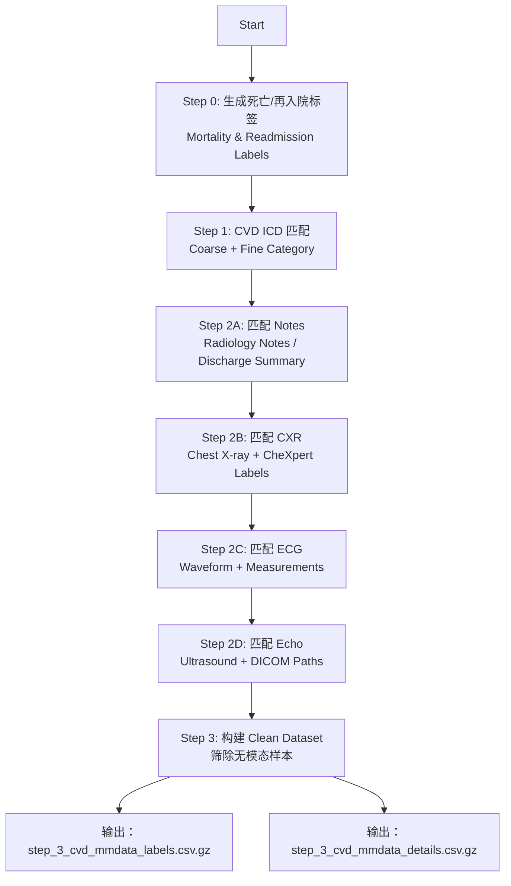

# 🩺 1. 项目目标（Project Goal）

该流程旨在整合 MIMIC-IV（v3.1）中与心血管疾病（Cardiovascular Disease, **CVD**）相关的数据，并匹配患者在住院期间的 **多模态信息（Multimodal Data）**：

- Notes（临床文本，如出院小结、影像报告）
- CXR（胸部 X 光影像）
- ECG（心电图 waveforms + 自动测量）
- Echo（超声心动图）

最终得到一个 **多模态 CVD 住院队列**，可直接用于模型训练、风险预测或医学研究。

---

# 📁 2. 数据目录结构（Directory Structure）

以下展现代码中使用的主要路径结构（已在代码中统一抽象为 PATHS 字典）：

```
CVD_MMData/
│
├── mimiciv/3.1/hosp/         # 住院表、ICD、患者基本信息
├── mimiciv/3.1/icu/          # ICU stays
├── mimiciv/note/             # 临床文本（radiology, discharge 等）
├── mimiciv/cxr/              # CXR 影像和 CheXpert 标签
├── mimiciv/ecg/              # ECG 测量与波形路径
├── mimiciv/echo/             # Echo（超声心动图）路径与 study meta
│
├── step0_death_admissionlabel/      # Step 0 输出
├── step1_cvd_filter/                 # Step 1 输出
└── step2_multimodal_matching/        # Step 2 与 Step 3 输出
```

---

# 🧩 3. 处理流程（Processing Pipeline）

流程共包含 **Step 0 → Step 1 → Step 2A/B/C/D → Step 3** 五个阶段。

---

# 📝 Step 0 — 生成死亡（Mortality）与再入院（Readmission）标签

**目的：** 为每次住院（hadm_id）生成预测任务需要的标签。

### ✔ 输入文件

- admissions.csv.gz（住院时间）
- patients.csv.gz（死亡日期）
- diagnoses_icd.csv.gz（诊断）

### ✔ 输出字段说明

| 字段                  | 含义                       |
| --------------------- | -------------------------- |
| mortality_in_hospital | 是否在住院期间死亡         |
| mortality_30d         | 出院后 30 日内死亡         |
| readmission_30d_hosp  | 出院后 30 日内再次入院     |
| readmission_30d_icu   | 出院后 30 日内再次入住 ICU |
| days_disch_to_death   | 出院距离死亡的天数         |

输出文件：`mimiciv_3_1_labels_details_[mode].csv.gz`

---

# 💓 Step 1 — CVD 标签匹配与队列筛选

**目的：根据 ICD-9/ICD-10，识别 CVD 相关的住院记录。**

本步骤基于两个分类文件：

- `CVD_coarse_category.csv`（粗粒度，例如：
  - **CHD** = Coronary Heart Disease 冠心病
  - **HF** = Heart Failure 心力衰竭
  - **VHD** = Valvular Heart Disease 瓣膜性心脏病
    ）
- `CVD_fine_category.csv`（细粒度，如 STEMI、NSTEMI、Ischemic Stroke 等）

### ✔ 输出字段

| 字段                | 含义                          |
| ------------------- | ----------------------------- |
| CVD_coarse_category | 粗粒度分类（CHD/HF/VHD 等）   |
| CVD_fine_category   | 细粒度分类（STEMI/Stroke 等） |

输出文件：`step_1_details_cvd_only_[mode].csv.gz`

仅保留 CVD 匹配到的住院记录。

---

# 🩻 Step 2 — 多模态数据匹配（Multimodal Matching）

本阶段将 Step 1 中的 CVD 队列与四类模态进行“住院时间窗口”匹配。

匹配标准：

> **模态数据的时间戳 ∈ [admittime, dischtime]**

## 2A — Note（临床文本）匹配

匹配：Radiology Notes、Discharge Summary

输出字段示例：

- has_note
- note_count
- matched_note_ids
- matched_note_times

## 2B — CXR（胸片）匹配

匹配：metadata + CheXpert labels + DICOM 路径

输出字段：

- has_cxr
- cxr_study_count
- matched_cxr_image_paths
- matched_cxr_CheXpert labels

## 2C — ECG（心电图）匹配

包含自动测量数值（rr_interval 等）与 note links。

输出字段：

- has_ecg
- ecg_count
- matched_ecg_waveform_paths

## 2D — Echo（超声心动图）匹配

匹配 Echo study meta + DICOM 路径。

输出字段：

- has_echo
- echo_study_count
- matched_echo_dicom_paths

最终输出文件：
`step_2d_details_cvd_with_note_with_cxr_with_ecg_with_echo_[mode].csv.gz`

---

# 🧼 Step 3 — CLEAN 版本（最终可用的数据）

**目的：只保留至少拥有一种模态数据的住院记录。**

筛选条件：

```
has_note == 1 OR has_cxr == 1 OR has_ecg == 1 OR has_echo == 1
```

输出两个文件：

### ✔ Clean Labels：用于训练

字段包含：

- subject_id, hadm_id
- ICD 标签（coarse/fine）
- 预后标签（mortality, readmission）
- 各模态是否存在（has\_\*）

文件：`step_3_cvd_mmdata_labels_[mode].csv.gz`

### ✔ Clean Details：用于加载模态内容

包含所有路径列表、模态时间、列表字段。

文件：`step_3_cvd_mmdata_details_[mode].csv.gz`

---

---

# **🩻 Step 2 & 3 — 多模态数据匹配与最终数据集（Detailed Outputs）**

本阶段是核心的数据整合环节。Step 2 生成原始模态数据和聚合的中间文件，Step 3 进行筛选和整理，产出最终可用于训练的 Clean 数据集。

## **A. Step 2 — 多模态匹配（Multimodal Matching）**

输出文件保存在 step2_multimodal_matching/ 目录下。

### **📄 中间细节文件（Cohort Details Augmented）**

这些文件在 Step 1 的 CVD 队列基础上，逐步加入各模态的匹配结果（has\_ 标志, count 计数, matched\_ 列表）。

| 文件名                                                           | 描述                                  | 关键新增属性（列）                                                                                          |
| :--------------------------------------------------------------- | :------------------------------------ | :---------------------------------------------------------------------------------------------------------- |
| step_2a_details_cvd_with_note\_\[mode\].csv.gz                   | **Notes 匹配结果聚合。**              | has_note, note_count, matched_note_ids (列表)                                                               |
| step_2b_details_cvd_with_note_with_cxr\_\[mode\].csv.gz          | **CXR 匹配结果聚合。**                | has_cxr, cxr_study_count, matched_cxr_dicom_ids (列表), matched_cxr\_\[CheXpert\] (14 个 CheXpert 标签列表) |
| step_2c_details_cvd_with_note_with_cxr_with_ecg\_\[mode\].csv.gz | **ECG 匹配结果聚合。**                | has_ecg, ecg_count, matched_ecg_waveform_paths (列表), matched_ecg\_\[Measurement\] (机器测量结果列表)      |
| step_2d_details_cvd_with_all_mm\_\[mode\].csv.gz                 | **所有模态最终聚合（Step 3 输入）。** | has_echo, echo_study_count, matched_echo_dicom_paths (列表)                                                 |

### **🖼 原始模态数据及元数据文件（Raw Modality Data）**

这些文件包含匹配到的原始文本内容、详细元数据或测量结果。

| 文件名                                        | 描述                                          | 包含信息                                                                      |
| :-------------------------------------------- | :-------------------------------------------- | :---------------------------------------------------------------------------- |
| cvd_matched_notes_content\_\[mode\].csv.gz    | **匹配到的病历笔记文本。**                    | subject_id, hadm_id, note_id, text (原始笔记文本)                             |
| cvd_matched_cxr_reports\_\[mode\].csv.gz      | **匹配到的 CXR 报告文本。**                   | subject_id, hadm_id, study_id, report_text, cxr_report_path                   |
| cvd_matched_cxr_metadata\_\[mode\].csv.gz     | **匹配到的 CXR 图像元数据及 CheXpert 标签。** | subject_id, hadm_id, dicom_id, cxr_image_path_relative \+ 14 个 CheXpert 标签 |
| cvd_matched_ecg_measurements\_\[mode\].csv.gz | **匹配到的 ECG 机器测量结果。**               | subject_id, study_id, ecg_time, 详细测量参数（如 rr_interval, p_axis 等）     |
| cvd_matched_ecg_details\_\[mode\].csv.gz      | **匹配到的 ECG 记录详细信息。**               | 包含测量结果、波形路径 (ecg_waveform_path_relative) 和关联的 Note ID          |
| cvd_matched_echo_details\_\[mode\].csv.gz     | **匹配到的 Echo 研究详细信息。**              | subject_id, hadm_id, study_id, echo_dicom_path_relative, 关联的 Note ID       |

## **B. Step 3 — CLEAN 版本（最终可用的数据）**

目的：只保留至少拥有一种模态数据的住院记录。  
筛选条件：has_note \== 1 OR has_cxr \== 1 OR has_ecg \== 1 OR has_echo \== 1  
输出文件保存在 step2_multimodal_matching/step_3_clean_version/ 目录下。

### **✔ Clean Labels：用于训练**

| 文件名                                        | 描述                                                                                           | 核心字段（列）                                                                                                                 |
| :-------------------------------------------- | :--------------------------------------------------------------------------------------------- | :----------------------------------------------------------------------------------------------------------------------------- |
| **step_3_cvd_mmdata_labels\_\[mode\].csv.gz** | **精简版标签集：** 仅包含 ID、诊断、预后标签、以及模态存在标志和计数。**用于直接的模型训练。** | subject_id, hadm_id, CVD_coarse/fine_category, mortality/readmission 标签, has_note, note_count, has_cxr, cxr_study_count 等。 |

### **✔ Clean Details：用于加载模态内容**

| 文件名                                         | 描述                                                                                                                          | 核心字段（列）                                                                                           |
| :--------------------------------------------- | :---------------------------------------------------------------------------------------------------------------------------- | :------------------------------------------------------------------------------------------------------- |
| **step_3_cvd_mmdata_details\_\[mode\].csv.gz** | **完整版细节集：** 包含所有标签、时间锚点和所有模态的**聚合列表**（如路径、ID、测量值列表）。**用于数据加载和模态内容检索。** | 包含 step_3_cvd_mmdata_labels 的所有字段，并新增 admittime 等时间列，以及所有 matched\_ 开头的列表字段。 |

---

# **📊 输出数据示例说明（常用字段）**

| 字段                     | 含义                                     |
| :----------------------- | :--------------------------------------- |
| matched_cxr_image_paths  | 与 hadm_id 匹配的所有 CXR DICOM 影像路径 |
| matched_ecg_study_ids    | 匹配到的 ECG study ID                    |
| matched_echo_dicom_paths | Echo DICOM 文件路径列表                  |
| CVD_coarse_category      | 心血管疾病粗分类                         |
| mortality_30d            | 是否在出院 30 天内死亡                   |

---

# 📊 输出数据示例说明（常用字段）

| 字段                     | 含义                                     |
| ------------------------ | ---------------------------------------- |
| matched_cxr_image_paths  | 与 hadm_id 匹配的所有 CXR DICOM 影像路径 |
| matched_ecg_study_ids    | 匹配到的 ECG study ID                    |
| matched_echo_dicom_paths | Echo DICOM 文件路径列表                  |
| CVD_coarse_category      | 心血管疾病粗分类                         |
| mortality_30d            | 是否在出院 30 天内死亡                   |

---

# ▶ 如何运行代码

默认运行 DEBUG 模式（速度快）：

```
python extract_cvd_multimodal_pipeline.py --mode DEBUG
```

运行完整数据（FULL 模式）：

```
python extract_cvd_multimodal_pipeline.py --mode FULL
```

---

# 📌 心血管疾病 ICD 匹配体系（CVD 分类体系）

本项目的 CVD 匹配基于 **两级分类体系**：

- **粗粒度分类（Coarse Categories）**：按照器官系统或大类疾病分组
- **细粒度分类（Fine Categories）**：对应临床常用亚型（如 STEMI、NSTEMI、TIA 等）

---

## 🟥 粗粒度（Coarse Categories）中英文 + ICD 范围

以下与代码中 `CVD_coarse_category.csv` 对应：

| InternalCode | ICD9 Range | ICD10 Range   | English Name                                                | 中文名称             |
| ------------ | ---------- | ------------- | ----------------------------------------------------------- | -------------------- |
| **CVD_A**    | 390–398    | I00–I09       | Rheumatic heart diseases                                    | 风湿性心脏病         |
| **CVD_B**    | 401–405    | I10–I16       | Hypertensive diseases                                       | 高血压及相关心血管病 |
| **CVD_C**    | 410–414    | I20–I25       | Ischemic heart diseases                                     | 缺血性心脏病         |
| **CVD_D**    | 415–417    | I26–I28       | Pulmonary heart disease and pulmonary circulation disorders | 肺心病及肺循环疾病   |
| **CVD_E**    | 420–429    | I30–I52 / I5A | Other heart diseases                                        | 其他心脏疾病         |
| **CVD_F**    | 430–438    | I60–I69       | Cerebrovascular diseases                                    | 脑血管疾病           |
| **CVD_G**    | 440–448    | I70–I79       | Arterial / arteriolar / capillary diseases                  | 动脉与微血管疾病     |
| **CVD_H**    | 451–459    | I80–I89       | Venous and lymphatic diseases                               | 静脉、淋巴管疾病     |

> 📝 粗分类常用于高层疾病研究，如“缺血性心脏病（CVD_C）”或“脑血管病（CVD_F）”。

---

## 🟦 细粒度（Fine Categories）中英文 + ICD 范围

以下与代码中 `CVD_fine_category.csv` 对应，包含更临床化的疾病实体，如 STEMI、心衰、TIA、脑梗等：

| InternalCode | ICD9 Code | ICD10 Code | English Name                                          | 中文名称                          |
| ------------ | --------- | ---------- | ----------------------------------------------------- | --------------------------------- |
| **CVD_A1**   | 394–397   | I05–I09    | Rheumatic valvular disease                            | 风湿性瓣膜病                      |
| **CVD_E1**   | 424       | I34–I37    | Nonrheumatic valvular disease                         | 非风湿性瓣膜病                    |
| **CVD_C1**   | 410       | I21–I22    | Acute myocardial infarction (AMI, incl. STEMI/NSTEMI) | 急性心肌梗死（含 STEMI / NSTEMI） |
| **CVD_C2**   | 414       | I24–I25    | Chronic ischemic heart disease                        | 慢性缺血性心脏病                  |
| **CVD_C3**   | 413       | I20        | Angina pectoris                                       | 心绞痛                            |
| **CVD_E2**   | 428       | I50        | Heart failure (HF)                                    | 心力衰竭                          |
| **CVD_E3**   | 425       | I42        | Cardiomyopathy                                        | 心肌病                            |
| **CVD_E4**   | 420       | I30–I32    | Pericarditis                                          | 心包炎                            |
| **CVD_E5**   | 422       | I40        | Myocarditis                                           | 心肌炎                            |
| **CVD_E6**   | 421 / 424 | I33–I38    | Endocarditis                                          | 心内膜炎                          |
| **CVD_E7**   | —         | I5A        | Non-ischemic myocardial injury                        | 非缺血性心肌损伤                  |
| **CVD_D1**   | 416       | I26–I28    | Pulmonary heart disease                               | 肺心病                            |
| **CVD_F1**   | 430       | I60        | Subarachnoid hemorrhage (SAH)                         | 蛛网膜下腔出血                    |
| **CVD_F2**   | 431       | I61        | Intracerebral hemorrhage (ICH)                        | 脑出血 / 颅内出血                 |
| **CVD_F3**   | 432       | I62        | Other intracranial hemorrhage                         | 其他颅内出血                      |
| **CVD_F4**   | 433–434   | I63        | Cerebral infarction (Ischemic Stroke)                 | 脑梗死 / 缺血性脑卒中             |
| **CVD_F5**   | 435       | G45        | TIA (Transient Ischemic Attack)                       | 短暂性脑缺血发作                  |
| **CVD_F6**   | 438       | I69        | Sequelae of cerebrovascular diseases                  | 脑血管病后遗症                    |
| **CVD_G1**   | 440       | I70        | Atherosclerosis                                       | 动脉粥样硬化                      |
| **CVD_G2**   | 441       | I71        | Aneurysm                                              | 动脉瘤                            |
| **CVD_G3**   | 443       | I73        | Occlusive peripheral arterial disease                 | 动脉闭塞性疾病                    |
| **CVD_H1**   | 451       | I80        | Phlebitis & thrombophlebitis                          | 静脉炎与血栓性静脉炎              |
| **CVD_H2**   | 457       | I88–I89    | Lymphatic diseases                                    | 淋巴系统疾病                      |
| **CVD_H3**   | 458–459   | I95–I99    | Other/unspecified circulatory disorders               | 其他循环系统疾病                  |

---

# 📚 附录 A — 数据源（PhysioNet Data Sources）

以下列出本项目使用的所有 PhysioNet 官方数据源，包含版本号与访问链接，便于复现及环境配置。

### **🌐 PhysioNet 数据源头**

| 数据集            | 版本   | PhysioNet 链接                                   |
| :---------------- | :----- | :----------------------------------------------- |
| **MIMIC-IV 核心** | v3.1   | https://physionet.org/content/mimiciv/3.1/       |
| **MIMIC-IV Note** | v2.2   | https://physionet.org/content/mimic-iv-note/2.2/ |
| **MIMIC-CXR**     | v2.1.0 | https://physionet.org/content/mimic-cxr/2.1.0/   |
| **MIMIC-IV ECG**  | v1.0   | https://physionet.org/content/mimic-iv-ecg/1.0/  |
| **MIMIC-IV Echo** | v0.1   | https://physionet.org/content/mimic-iv-echo/0.1/ |

---

# 📊 附录 B — 多模态匹配流程图（Multimodal Matching Flowchart）

下图展示整个 CVD 多模态数据处理流水线，从 Step 0 标签生成 → Step 1 CVD 匹配 → Step 2 多模态匹配 → Step 3 Clean 数据集构建。  
该图示特别适合 README 展示、论文 Methods 流程图、项目报告等用途。



### ✔ 图示说明

- **Step 0**：为每次住院生成基础标签（死亡、再入院）。
- **Step 1**：利用 ICD9/ICD10 匹配粗粒度及细粒度 CVD 分类。
- **Step 2A–2D**：逐步将 Notes、CXR、ECG、Echo 按住院时间窗口进行匹配。
- **Step 3**：仅保留至少拥有一种模态的 CVD 入院记录，形成最终数据集。
